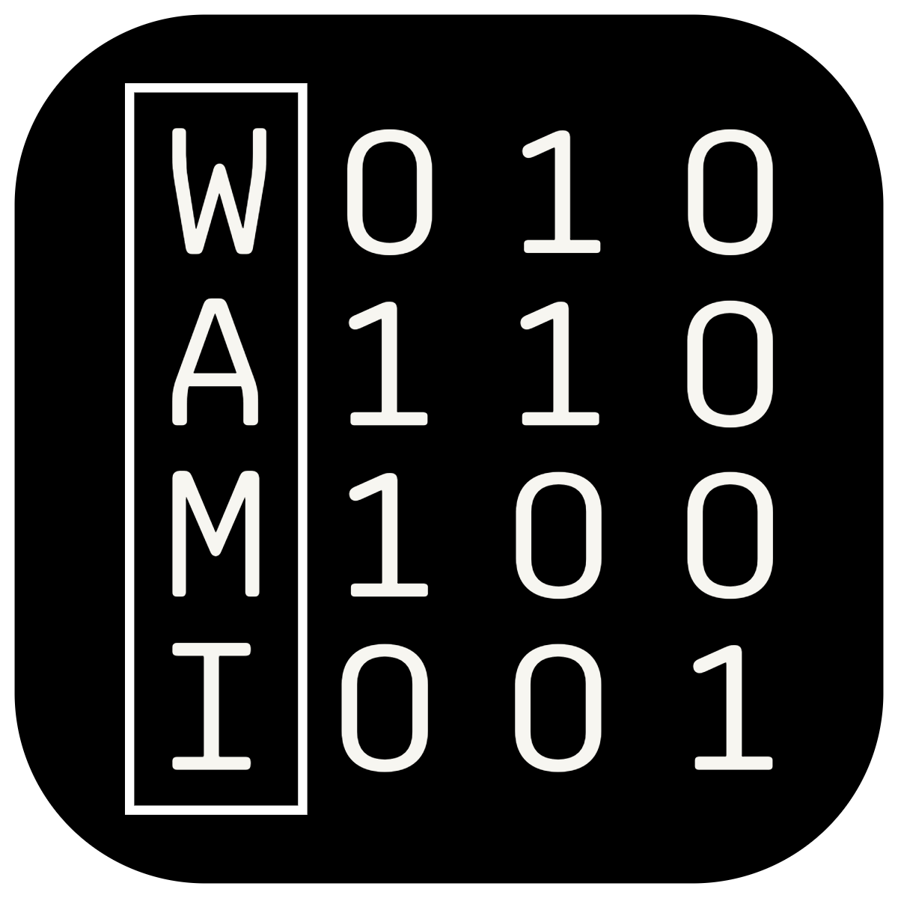

# WAMI - What am I
## Description:
WAMI is a user-friendly tool designed in Rust language, powered by Cargo, to assist individuals who struggle with remembering the names of the various programs they utilize. This open-source program aims to simplify the process of finding the most suitable programs for specific tasks.

## Features:
1. Program Recommendation: Wami analyzes the requirements of a given task and suggests the optimal programs to accomplish it efficiently.

2. User-Friendly Interface: The intuitive interface of Wami ensures a seamless experience for users of all skill levels.

3. Customization: Users can personalize their preferences and prioritize certain programs based on their individual needs.

## Templates
WAMI will use the official [wami-templates](https://github.com/evait-security/wami-templates) repository as a datasource. Please refer to this repository if you want to add a new tool suggestion.

## How it Works:
WAMI utilizes advanced algorithms written in Rust to evaluate the characteristics and functionalities of different programs. By matching the task requirements with program capabilities, it generates recommendations that maximize productivity.

## Contributions:
Contributions to Wami are highly encouraged. Developers can add new programs, improve existing algorithms, and enhance the user interface. By collaborating on this project, we can create a comprehensive program repository for the benefit of all users.

## Installation:
To install Wami, follow these steps:
1. Clone the repository from GitHub: `git clone git@github.com:evait-security/wami.git`
2. Navigate to the project directory: `cd wami`
3. Build the project using Cargo: `make install`
5. Reload the shell: `exec zsh`
4. Launch the program: `wami`

## Feedback and Support:
We value your feedback and appreciate any bug reports or suggestions. Please open an issue on our GitHub repository to provide feedback or seek support.

## License:
WAMI is released under the MIT License. Feel free to modify, distribute, and use the program for personal or commercial purposes.

Let's simplify program management and boost productivity with Wami! Together, we can conquer the challenge of remembering program names using the power of Rust and Cargo.
